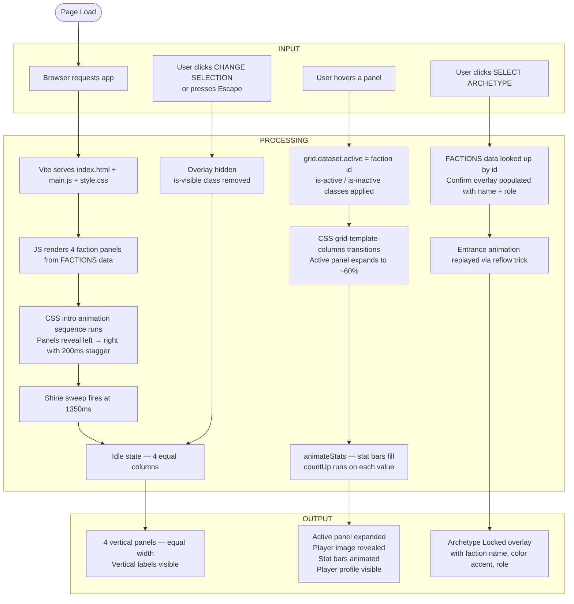

# FACTIONS — Tennis Archetype Selector

**AI 201: Creative Computing with AI**
SCAD Spring 2026 — Professor Tim Lindsey
Project by Firas Benchouikha

**Live site:** https://benchouikhafiras059-maker.github.io/vite-app-/

---

## System Flow



---

## What It Is

An interactive single-page experience where users choose between four tennis player archetypes. Each archetype is a full-height vertical panel that expands on hover, revealing a cinematic player portrait, animated performance stats, and player profile.

---

## The Four Archetypes

| # | Archetype | Player | Identity |
|---|-----------|--------|----------|
| 01 | BASELINER | Novak Djokovic | Control · Precision |
| 02 | AGGRESSOR | Carlos Alcaraz | Power · Dominance |
| 03 | DEFENDER | Andy Murray | Speed · Stamina |
| 04 | PLAYMAKER | Nick Kyrgios | Vision · Creativity |

---

## Built With

- **Vite 5** — vanilla JS, no framework
- **CSS Grid** — animated column expansion via `grid-template-columns`
- **CSS custom properties** — per-faction color theming
- **Google Fonts** — Barlow Condensed + Barlow
- **GitHub Actions** — auto-deploy to GitHub Pages on push to `main`

---

## Run Locally

```bash
npm install
npm run dev
```

Open `http://localhost:5173/vite-app-/`

---

---

# ESF Documentation

---

## 1. Design Intent

> *This section must be written in your own words. It documents the creative decisions you made before any code was written. Per assignment rules, AI-generated Design Intents are academic dishonesty.*

**Concept:**
This project reimagines a traditional character selection screen as a tennis-based playstyle system, where users choose an identity rather than a character. Each archetype represents a distinct way of playing the game, inspired by real athletes but abstracted into a clean, minimal interface. The experience focuses on atmosphere, hierarchy, and interaction to guide users through a cinematic yet intuitive decision-making moment.

**Color palette:**
- BASELINER: `#0D1824` background, `#4EC9E1` accent — cold, precise, clinical blue
- AGGRESSOR: `#1E0808` background, `#FF2D2D` accent — aggressive red, high energy
- DEFENDER: `#081A10` background, `#39FF6E` accent — endurance green, alive
- PLAYMAKER: `#100A1A` background, `#A855F7` accent — creative purple, unpredictable

**Typography:**
- Headers: Barlow Condensed — condensed, athletic, modern
- Body: Barlow — clean and readable

**Hover behavior:**
- Hovered panel expands to ~60% width, others collapse to slivers
- Player image fades in and zooms slightly
- Stat bars animate from 0 to value
- Content slides up from bottom

**Mood:**
- Cinematic. Premium. Like a sports broadcast meets a luxury brand.

**Non-negotiables:**
- The interface must remain minimal and typography-driven, avoiding unnecessary UI elements or clutter.
- Every interaction must feel intentional and premium, using subtle motion instead of exaggerated effects.
- The system must communicate identity through playstyle, not just visuals, ensuring each archetype feels meaningful and distinct.

---

## 2. AI Direction Log

*3–5 entries documenting what I asked AI to do, what it produced, and what I kept, changed, or rejected.*

---

**Entry 1 — Initial Layout**

- **Asked:** Build a 4-panel vertical faction selector with CSS Grid that expands the hovered panel and collapses the others
- **AI produced:** A working CSS grid with `grid-template-columns` animation, using fantasy faction names (VEIL, TITAN, NOVA, ASCEND)
- **Decision:** Kept the grid approach entirely — it was exactly the mechanic I wanted. Rejected the faction names and replaced them with tennis archetypes (BASELINER, AGGRESSOR, DEFENDER, PLAYMAKER) to match my concept

---

**Entry 2 — Cinematic Image Integration**

- **Asked:** Integrate player photos into each panel with a dark cinematic look so text stays readable over the image
- **AI produced:** A three-layer gradient overlay system: left-to-right gradient protecting text, bottom-to-top gradient protecting the CTA area, and a radial vignette for cinematic edge darkening
- **Decision:** Kept the layered gradient approach. Went through multiple rounds of adjusting `background-position` per panel to properly frame each player's face. The image positioning required iterative direction — AI couldn't see the result, I had to keep giving feedback

---

**Entry 3 — Stat Bar Interaction**

- **Asked:** Make the performance stats (CONTROL, POWER, etc.) interactive
- **AI first produced:** Click-to-reveal stat bars with button UI
- **Decision:** Rejected the click interaction. Directed AI to change it to hover-triggered — stats animate in when the panel becomes active, reset when it becomes inactive. This felt cleaner and removed unnecessary UI elements

---

**Entry 4 — Intro Animation**

- **Asked:** Create a sequential intro where panels reveal one by one, left to right, then finish with a shine sweep
- **AI produced:** All panels animating with only 130ms stagger — too fast to read as sequential
- **Decision:** Rejected the timing. Directed AI to increase stagger to 200ms so each panel clearly reads as a distinct reveal. Also caught a bug where Panel 4 appeared first because the `nth-child` selectors were offset by 1 due to a hidden `div` being the first child of the grid

---

**Entry 5 — Player Info Panel**

- **Asked:** Add structured player content to each expanded panel: who the player is, why they represent the archetype, and their key achievements
- **AI produced:** A clean player identity line (name + label), updated description text, and a compact achievement list with accent-colored bullet dots
- **Decision:** Kept the structure. Reviewed and approved the player content for all four archetypes (Djokovic, Alcaraz, Murray, Kyrgios)

---

## 3. Records of Resistance

*Three moments where I rejected or significantly revised AI output.*

---

**Resistance 1 — Rejected the faction names**

- **What AI produced:** Fantasy-style faction names — VEIL, TITAN, NOVA, ASCEND — with matching sci-fi color schemes
- **Why I rejected it:** This wasn't the concept. I wanted the project to be grounded in real sport — tennis archetypes with real players. Generic fantasy names had no identity or credibility
- **What I did instead:** Replaced all four names with tennis archetypes (BASELINER, AGGRESSOR, DEFENDER, PLAYMAKER) and assigned real players to each one based on their actual playing style

---

**Resistance 2 — Rejected the click-based stat interaction**

- **What AI produced:** Stat bars that revealed on click, with a small button to trigger them
- **Why I rejected it:** Adding a button inside the panel created an extra interaction layer that felt clunky. The panel expanding on hover should be enough of a trigger — everything inside should respond to that same gesture
- **What I did instead:** Directed AI to animate stats automatically on hover, and reset them when the panel collapses. No buttons needed

---

**Resistance 3 — Caught and fixed the animation ordering bug**

- **What AI produced:** An intro animation where Panel 4 (PLAYMAKER) appeared immediately on load while Panels 1–3 animated in
- **Why I rejected it:** The entire point of the intro was to present the archetypes one by one, left to right. Panel 4 appearing first completely broke the intended sequence
- **What I did instead:** Investigated the issue and identified that a hidden `div.intro__sweep` was the first child of the grid, pushing all `nth-child` selectors off by one. Directed AI to shift selectors from `nth-child(1–4)` to `nth-child(2–5)` to match the actual DOM order

---

## 4. Five Questions Reflection

*Answered before final submission.*

---

**1. Can I defend this?**

Yes. Every decision, from layout to interaction, was intentional and supports clarity, hierarchy, and the idea of choosing a playstyle.

---

**2. Is this mine?**

Yes. I defined the concept, structure, and direction. AI helped execute and refine, but the core idea and decisions are mine.

---

**3. Did I verify?**

Yes. I tested interactions, alignment, and animations to make sure everything works as expected.

---

**4. Would I teach this?**

Yes. I understand both the design and interaction well enough to explain how and why it works.

---

**5. Is my documentation honest?**

Yes. I clearly documented what I asked AI to do, what I changed, and what I kept.
